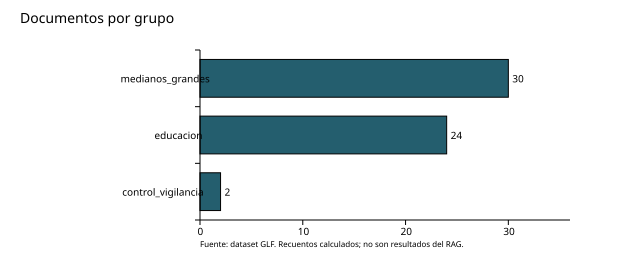

# Análisis exploratorio de datos

Resultados del corpus entregado, recalculados el 27 de septiembre de 2026. El programa `src/eda.py` reproduce los agregados y las seis figuras sin publicar textos de expedientes. El notebook `notebooks/01_exploracion.ipynb` utiliza ese mismo código.

| Unidad | Cantidad |
|---|---:|
| Documentos de casos | 56 |
| Expedientes emparejados | 26 |
| Fragmentos de casos | 250 |
| Palabras en texto documental procesado | 147.470 |

Los dos documentos de contexto no son expedientes emparejados adicionales. Los registros CSV y JSONL equivalentes no deben sumarse. La cifra histórica de 148.082 palabras corresponde al inventario, no al recuento del texto anonimizado entregado.

## Composición y particiones

Existen 26 propuestas, 27 screenings, una evaluación administrativa, un PGAS/ESMP y una nota de contexto. Dos expedientes tienen dos evaluaciones.

Los idiomas son etiquetas existentes: 30 documentos en inglés y 26 en español. No se certificó idioma con un clasificador independiente.

Los grupos tienen tamaños distintos; las frecuencias documentales no equivalen a frecuencias de expedientes.

La división 18/4/4 se realiza por expediente. No se detectaron códigos de proyecto repartidos entre particiones. Cuatro expedientes de prueba permiten una evaluación pequeña, no una estimación representativa de toda la población.

Los documentos de contexto aportan 62 fragmentos. DOC-001 aporta 61 y 39.239 palabras, lo que exige revisar diversidad de fuentes en la recuperación.

Las longitudes se calculan separando el texto por espacios en blanco. Son palabras, no tokens. Los fragmentos contienen solapamiento; no sumar sus longitudes como texto único. Los intervalos de la figura son descriptivos, no umbrales de calidad.

## Calidad y decisiones de preparación

- DOC-045 y DOC-046 tienen texto procesado idéntico y están en validación. Revisar originales antes de eliminar una versión del índice.
- Las páginas vacías corresponden a 29 DOCX y un TXT. No confundir ausencia de paginación estructurada con fallo de extracción.
- La anonimización automática registra 370 sustituciones; requiere revisión humana y no prueba ausencia de información sensible.
- Mantener documentos y evaluaciones del mismo expediente en su partición. Excluir del contexto de prueba las respuestas humanas usadas como referencia.
- El corpus normativo contiene 1.272 fragmentos, incluidos 585 españoles, de 88 textos normalizados. El README original tiene un registro menos en ambos conteos.
- En el corpus normativo, `words` describe el documento de origen. Añadir métricas por fragmento antes de aplicar límites del modelo.

El EDA no mide Recall@5, latencia ni costos. La fidelidad de extracción frente a todos los originales, traducciones y vigencia normativa permanece pendiente. Las seis figuras amplían la cobertura visual de la rúbrica; no sustituyen esos controles.
