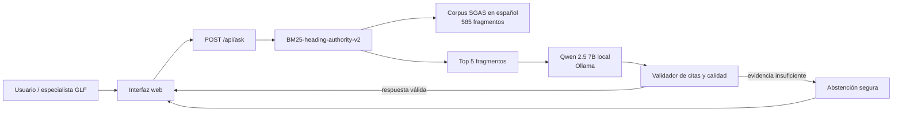
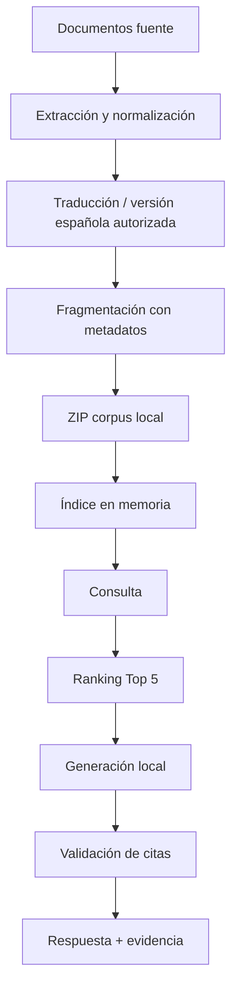

# Arquitectura del sistema

## 1. Propósito

El proyecto implementa un asistente RAG para consultar salvaguardas ambientales y sociales del Galápagos Life Fund (GLF). El sistema recupera evidencia documental verificable y genera una respuesta breve en español con citas. No aprueba, rechaza ni determina la elegibilidad de una postulación.

## 2. Arquitectura general

## 3. Componentes

### 3.1 Interfaz
La aplicación integrada se sirve desde `app/index.html` mediante `app/server.py`. El módulo “Asistente RAG GLF” permite ingresar una pregunta, muestra la respuesta, el tiempo total y la evidencia documental asociada.

### 3.2 API local
`app/server.py` expone:

- `GET /`: interfaz.
- `GET /api/status`: estado del corpus y del recuperador.
- `POST /api/search`: recuperación sin generación.
- `POST /api/ask`: recuperación + generación local.

El servidor de desarrollo escucha únicamente en `127.0.0.1`.

### 3.3 Recuperación
El recuperador final es `BM25-heading-authority-v2`, implementado en `src/retrieval_optimized.py`.

Configuración congelada:

| Parámetro | Valor |
|---|---:|
| BM25 cuerpo k1 | 0.8 |
| BM25 cuerpo b | 0.2 |
| BM25 encabezados k1 | 1.2 |
| BM25 encabezados b | 0.3 |
| Peso de encabezados | 0.30 |
| Prioridad fuente GLF | 0.15 |
| Top-k | 5 |

La función de ranking combina relevancia léxica del cuerpo, relevancia del encabezado y una prioridad pequeña para documentos GLF. No contiene respuestas fijas ni excepciones por identificador de pregunta.

### 3.4 Generación
`app/ollama.py` utiliza Qwen 2.5 7B a través de Ollama local. El modelo recibe únicamente la pregunta y los fragmentos recuperados.

Controles implementados:

- temperatura 0;
- contexto acotado;
- citas obligatorias con `chunk_id`;
- rechazo de citas a fragmentos no recuperados;
- un reintento controlado si la respuesta es formalmente inválida o incompleta;
- abstención segura cuando no existe evidencia suficiente;
- no se registran las preguntas del usuario.

### 3.5 Corpus
El corpus normativo final de consulta contiene 585 fragmentos en español provenientes del Manual SGAS, anexos y documentos de referencia. El ZIP autorizado se mantiene local y no se publica en GitHub.

## 4. Pipeline de datos

## 5. Tecnologías

- Python 3.11.
- NumPy.
- Ollama.
- Qwen 2.5 7B.
- HTTP server de Python para la versión local.
- HTML, JavaScript y Tailwind CSS para la interfaz.
- Pytest para pruebas automáticas.
- Git/GitHub para versionamiento.

## 6. Rendimiento observado

- Recall@5 train: 80.6%.
- Recall@5 validation: 90.9%.
- Recall@5 train+validation: 83.6%.
- Holdout post-congelamiento confirmado por usuario: 85.0%.
- Hit@5 desarrollo: 94.7%.
- Latencia p95 extremo a extremo: 4.617 s.
- Prueba funcional local: 40/40 consultas sin error HTTP.
- Suite actual: 26 tests aprobados y 2 omitidos por depender de artefactos privados.

## 7. Alcance y límites

El sistema es asistencia documental. La interpretación normativa final y cualquier decisión institucional corresponden a personas autorizadas. El prototipo local no debe exponerse directamente a Internet sin una capa de despliegue, autenticación, observabilidad y revisión de permisos de redistribución del corpus.
