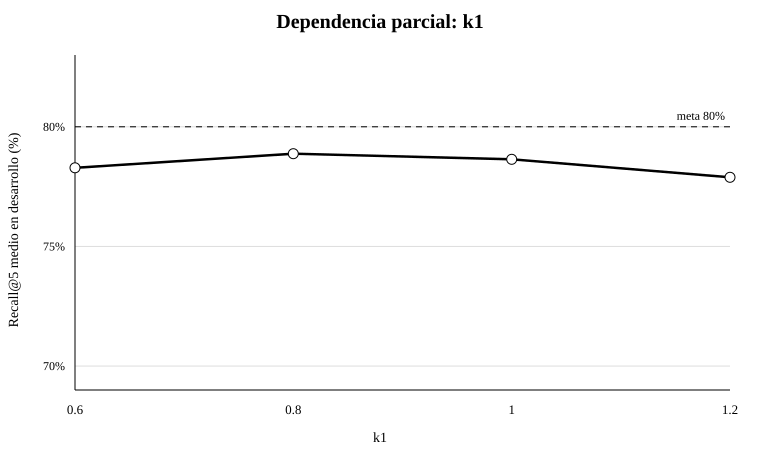
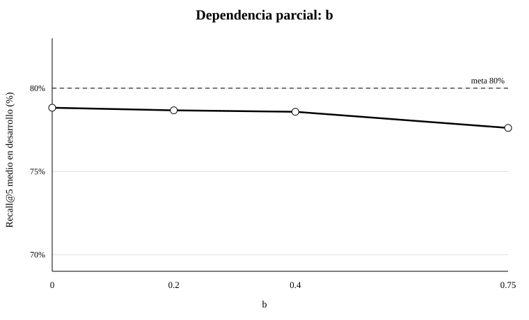
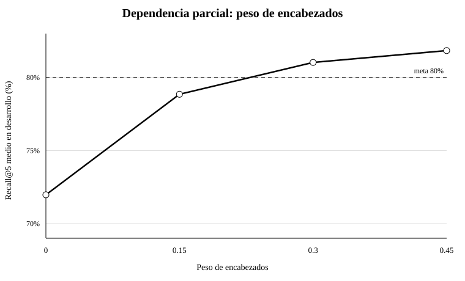
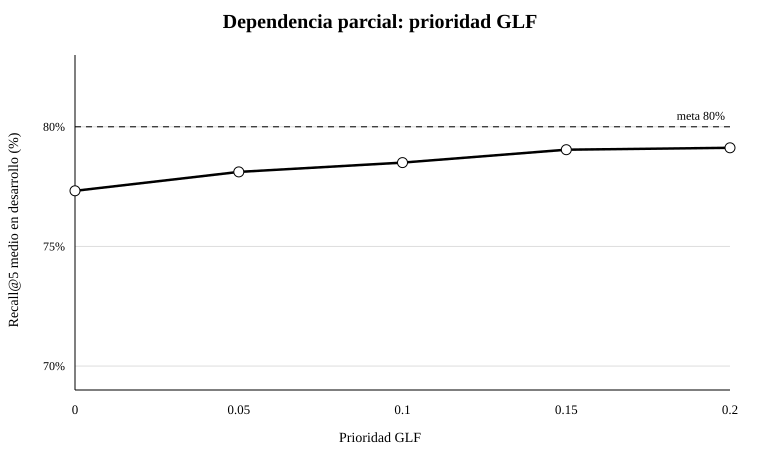
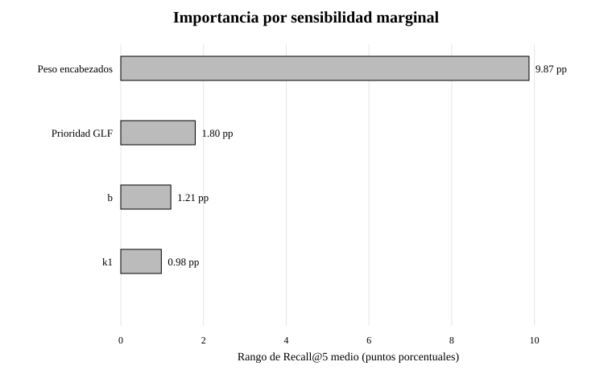
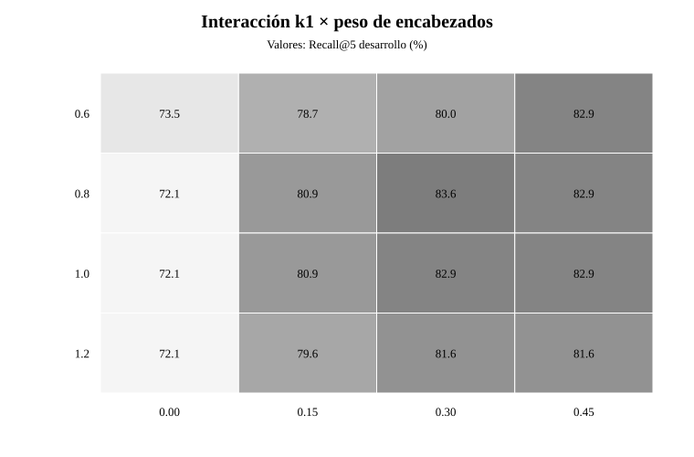
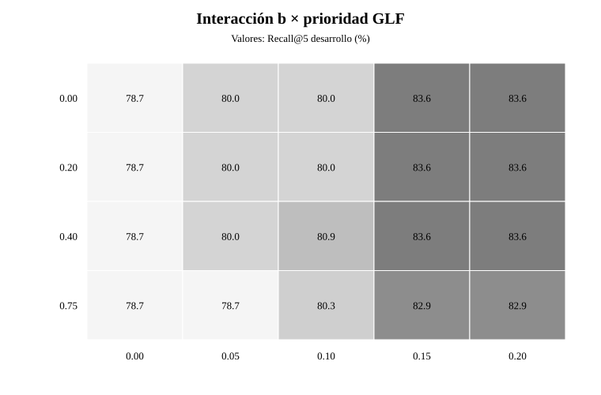

# Optimización de hiperparámetros — Asistente RAG de salvaguardas GLF

## 1. Objetivo

La optimización buscó elevar **Recall@5** del recuperador documental sin utilizar el conjunto de test para seleccionar parámetros. El objetivo operativo vigente del proyecto es **Recall@5 ≥ 80%** y la configuración final debía mantener trazabilidad, interpretabilidad y baja latencia.

El corpus de recuperación contiene **585 fragmentos en español**. Para desarrollo se utilizaron **27 preguntas train y 11 validation** del gold operativo v2. El test histórico no se utilizó para escoger parámetros.

## 2. Baselines comparados

| Método | Recall@5 train+validation |
|---|---:|
| E5-base | 61.8% |
| BM25 + E5 RRF | 68.6% |
| BM25 baseline | 68.9% |

BM25 fue el mejor punto de partida de validación y además ofrecía menor complejidad y mayor interpretabilidad.

## 3. Primera etapa: ajuste de BM25

Se exploró una rejilla pequeña de `k1` y `b`.

| k1 | b | Recall@5 train | Recall@5 validation | Recall@5 desarrollo |
|---:|---:|---:|---:|---:|
| 1.0 | 0.2 | 67.3% | 81.8% | **71.5%** |
| 0.8 | 0.75 | 67.3% | 81.8% | 71.5% |
| 1.2 | 0.2 | 66.4% | 81.8% | 70.8% |
| 1.0 | 0.4 | 66.4% | 81.8% | 70.8% |
| 0.8 | 0.9 | 66.4% | 81.8% | 70.8% |
| 1.5 | 0.75 | 63.6% | 81.8% | 68.9% |

El ajuste de BM25 solo mejoró el Recall@5 de desarrollo de **68.9% a 71.5%**, por lo que no alcanzaba el objetivo.

## 4. Segunda etapa: encabezados y autoridad documental

El análisis de errores mostró que los encabezados normativos contienen señales fuertes. Se añadió:

- BM25 para cuerpo del fragmento.
- BM25 separado para encabezados.
- Peso adicional de encabezados.
- Pequeña prioridad para documentos GLF frente a referencias externas.
- Top-k fijo en 5.

La configuración seleccionada y posteriormente congelada fue:

| Hiperparámetro | Valor final |
|---|---:|
| BM25 cuerpo `k1` | **0.8** |
| BM25 cuerpo `b` | **0.2** |
| BM25 encabezados `k1` | **1.2** |
| BM25 encabezados `b` | **0.3** |
| Peso de encabezados | **0.30** |
| Prioridad de fuente GLF | **0.15** |
| Top-k | **5** |

No existen reglas por pregunta ni IDs de chunks codificados manualmente.

## 5. Comparación antes/después

| Métrica | BM25 baseline | Configuración final | Mejora |
|---|---:|---:|---:|
| Recall@5 train | 63.6% | **80.6%** | **+17.0 pp** |
| Recall@5 validation | 81.8% | **90.9%** | **+9.1 pp** |
| Recall@5 train+validation | 68.9% | **83.6%** | **+14.7 pp** |
| Hit@5 train+validation | 86.8% | **94.7%** | **+7.9 pp** |
| MRR@5 train+validation | 0.557 | **0.752** | **+0.195** |

La configuración final superó el umbral de Recall@5 ≥80% tanto en train como en validation.

## 6. Robustez

Varias configuraciones vecinas también superaron 80% simultáneamente en train y validation:

| k1 | b | Peso encabezados | Prioridad GLF | Train | Validation | Desarrollo |
|---:|---:|---:|---:|---:|---:|---:|
| 0.8 | 0.2 | 0.30 | 0.15 | 80.6% | 90.9% | 83.6% |
| 0.8 | 0.4 | 0.30 | 0.15 | 80.6% | 90.9% | 83.6% |
| 0.8 | 0.0 | 0.30 | 0.15 | 80.6% | 90.9% | 83.6% |
| 0.8 | 0.4 | 0.30 | 0.10 | 80.6% | 81.8% | 80.9% |

Esto reduce la probabilidad de que el resultado dependa de un único punto accidental.

## 7. Análisis de sensibilidad y dependencia parcial

Para documentar el Workshop S5 se ejecutó **después del congelamiento** una rejilla factorial de **320 configuraciones** alrededor de la solución final. Se utilizó exclusivamente para sensibilidad: **no cambió la configuración final y no utilizó test ni holdout para seleccionar parámetros**.

Rangos:

- `k1`: 0.6, 0.8, 1.0, 1.2
- `b`: 0.0, 0.2, 0.4, 0.75
- peso de encabezados: 0.0, 0.15, 0.30, 0.45
- prioridad GLF: 0.0, 0.05, 0.10, 0.15, 0.20

En un recuperador no existe una función `predict()` equivalente a un estimador supervisado. Por ello, los *partial dependence plots* se implementan como **dependencia marginal del Recall@5**, promediando cada valor sobre las combinaciones de los demás hiperparámetros.

## 8. Ranking de importancia

La importancia se estimó como el rango entre el mayor y menor Recall@5 marginal medio:

| Hiperparámetro | Rango marginal de Recall@5 |
|---|---:|
| Peso de encabezados | **9.87 pp** |
| Prioridad GLF | 1.80 pp |
| `b` | 1.21 pp |
| `k1` | 0.98 pp |

El ranking mide sensibilidad dentro de la rejilla estudiada y no debe interpretarse como importancia causal.

## 9. Interacciones

Se analizaron:

1. `k1 × peso de encabezados`, manteniendo `b=0.2` y prioridad GLF `0.15`.
2. `b × prioridad GLF`, manteniendo `k1=0.8` y peso de encabezados `0.30`.

La mejor región combina un `k1` moderado con peso de encabezados cercano a `0.30`. La prioridad GLF ayuda a desempatar fuentes primarias, pero incrementos mayores no generaron una mejora clara del Recall@5.

## 10. Control de sobreajuste

La configuración final quedó congelada antes de la evaluación posterior. El test histórico no se utilizó para ajuste. Posteriormente, un holdout post-congelamiento confirmado por el usuario obtuvo **Recall@5 = 85.0%**; se conserva como evidencia adicional y no como criterio de selección.

La latencia extremo a extremo se midió aparte con Qwen local: **p95 = 4.617 s**, por debajo de la meta de 7 s.

## 11. Conclusión

La mejora principal no provino solo de cambiar `k1` y `b`, sino de adaptar el recuperador a la estructura del corpus: separar cuerpo y encabezados y priorizar moderadamente las fuentes GLF. El Recall@5 de desarrollo pasó de **68.9% a 83.6%** y validation alcanzó **90.9%**, manteniendo una arquitectura interpretable y de baja latencia.

La configuración queda congelada como **BM25-heading-authority-v2** y no debe modificarse con base en resultados de test o holdout.
